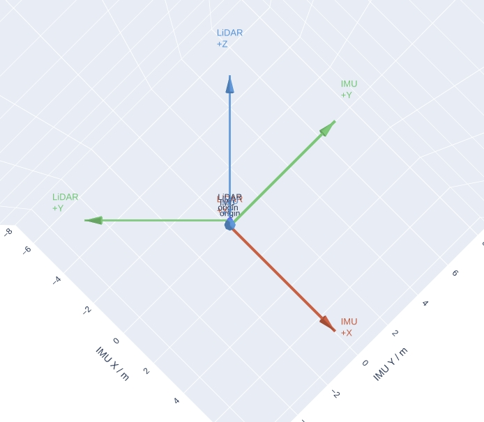
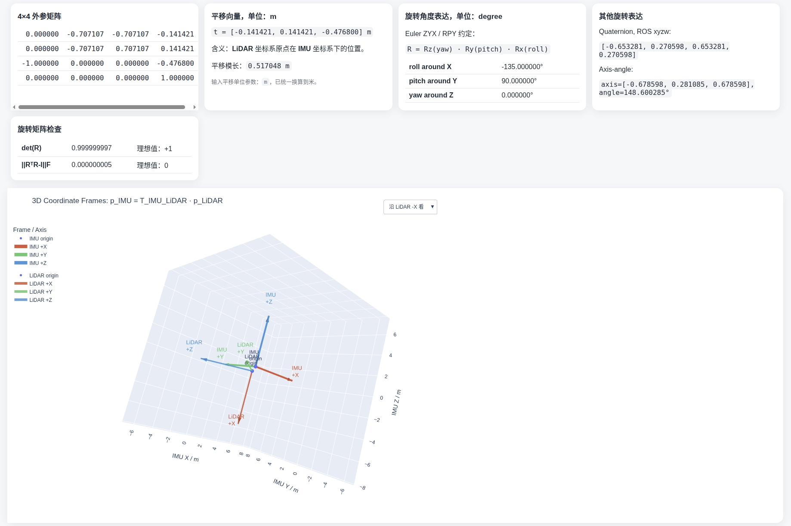

# Extrinsic Visualizer Plus

用于验证多传感器外参（LiDAR/IMU/Camera 等）的可视化与报告工具。
主脚本：`extrinsic_visualizer_plus.py`

## 功能

- 支持多种输入格式并统一转换为 4x4 外参矩阵
- 支持矩阵求逆（`--inverse`）
- 支持平移单位换算（`m/cm/mm`）
- 生成单个 HTML 报告页面：
  - 数值报告（矩阵、平移、Euler、四元数、轴角、旋转诊断）
  - 3D 交互坐标系可视化（Plotly）
- 支持视角下拉切换（沿 target/source 各轴正反方向观察）
- 可选自动在浏览器打开（`--open`）

## 示例展示



## 安装依赖

```bash
pip install numpy plotly
```

## 数学约定

采用如下约定：

```text
p_target = T_target_source @ p_source
```

- `T[:3,:3]`：`source -> target` 的旋转
- `T[:3,3]`：`source` 原点在 `target` 坐标系下的位置

Euler 角约定（脚本内固定）：

```text
R = Rz(yaw) @ Ry(pitch) @ Rx(roll)
```

即 ZYX yaw-pitch-roll。

## 快速开始

### 1. 用 4x4 文件输入

```bash
python extrinsic_visualizer_plus.py \
  --file example_data/example_np.json \
  --source LiDAR \
  --target IMU \
  --output lidar_to_imu.html
```

### 2. 直接传 ROS 四元数格式（tx ty tz qx qy qz qw）

```bash
python extrinsic_visualizer_plus.py \
  --input "0.1 0.2 0.3 0 0 0 1" \
  --format tq_xyzw \
  --source Camera \
  --target Base \
  --output cam_to_base.html
```

### 3. 传平移 + RPY（角度制）

```bash
python extrinsic_visualizer_plus.py \
  --input "0.1 0.2 0.3 10 0 90" \
  --format xyzrpy_deg \
  --source LiDAR \
  --target IMU
```

### 4. 输入反方向矩阵并取逆

```bash
python extrinsic_visualizer_plus.py \
  --file example_data/example.json \
  --inverse \
  --source IMU \
  --target LiDAR
```

## 输入格式

通过 `--format` 指定：

- `auto`：
  - 16 个数 -> 4x4
  - 7 个数 -> `tx ty tz qx qy qz qw`
  - 6 个数 -> `tx ty tz roll pitch yaw`（默认按度）
- `matrix4x4`：严格 16 个数（可写成矩阵样式）
- `flat16`：严格 16 个数（按行 reshape）
- `tq_xyzw`：`tx ty tz qx qy qz qw`
- `tq_wxyz`：`tx ty tz qw qx qy qz`
- `xyzrpy_deg`：`tx ty tz roll pitch yaw`（degree）
- `xyzrpy_rad`：`tx ty tz roll pitch yaw`（radian）

说明：解析时会提取文本中的数字，因此空格、逗号、分号、换行、`[]` 等分隔都可接受。

## 命令行参数

```text
--input               输入变换文本
--file                输入文件（txt/json，按文本解析）
--format              输入格式，默认 auto
--translation-unit    输入平移单位：m/cm/mm（输出统一为 m）
--source              源坐标系名称
--target              目标坐标系名称
--axis-length         可视化坐标轴长度（米）
--inverse             可视化前先求逆
--output              输出 HTML 路径
--open                生成后自动浏览器打开
```

查看完整帮助：

```bash
python extrinsic_visualizer_plus.py --help
```

## 输出内容

运行后会输出：

1. 终端信息
- 4x4 外参矩阵
- 平移向量 `t` 及模长
- Euler ZYX 角度（deg）
- 旋转诊断：`det(R)` 与 `||R.T @ R - I||_F`

2. HTML 报告页面
- 矩阵表格
- 平移信息（米）
- Euler / Quaternion / Axis-angle
- 旋转合法性检查提示
- 3D 坐标系交互图与视角切换菜单

## 打开 HTML

- 本机直接打开：
  - Linux: `xdg-open <output.html>`
  - macOS: `open <output.html>`
  - Windows: `start <output.html>`
- 远程服务器可用静态服务：


## 注意事项

- 平移单位会先按 `--translation-unit` 转成米，再执行 `--inverse`。
- 如果同时传 `--input` 和 `--file`，代码会优先使用 `--input`。
- 旋转诊断异常（`det(R)` 偏离 1 或正交误差大）通常意味着输入方向、单位或旋转定义有问题。
